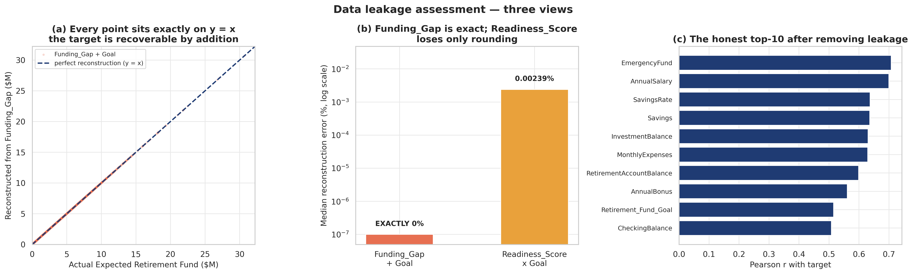
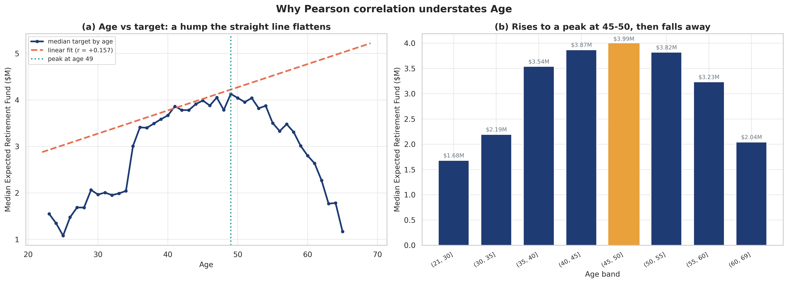
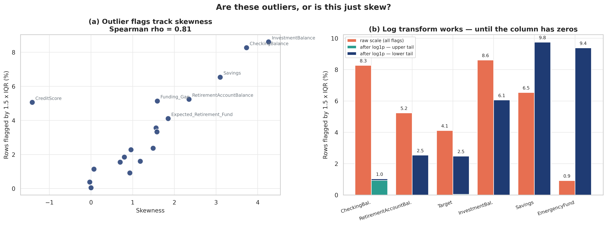
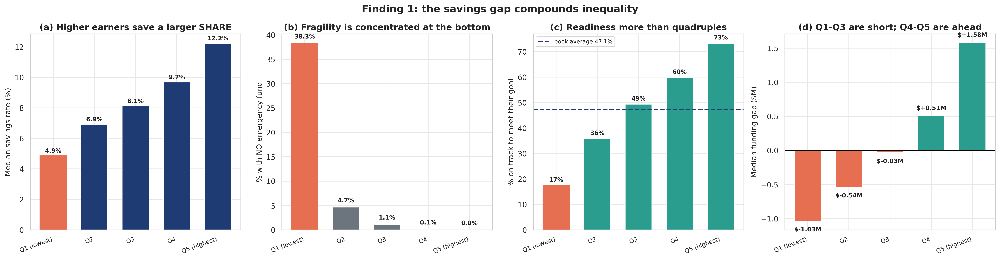
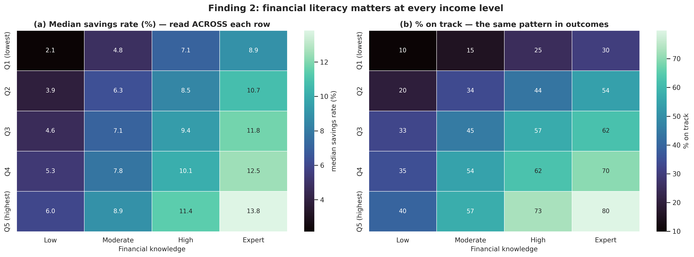

# Retirement Readiness — Exploratory Data Analysis

Predicting a customer's **`Expected_Retirement_Fund`** from demographic, income, balance-sheet,
and behavioural attributes. This repository contains the EDA stage: a full assessment of whether
the dataset can support the modelling task, what must be fixed before training, and what the data
says about the business.

**Dataset:** 30,000 pre-retirement customers × 32 columns (synthetic)
**Target:** `Expected_Retirement_Fund` — continuous, USD
**Task:** Supervised regression
**Notebook:** [01_exploratory_data_analysis.ipynb](notebooks/01_exploratory_data_analysis.ipynb)

---

## TL;DR — what the EDA found

The dataset is **suitable for supervised regression, conditional on removing three leakage
columns.** Overall ML-readiness score: **3.7 / 5.0**, held down almost entirely by that one issue.

| # | Finding | Action |
|---|---|---|
| 1 | **`Funding_Gap` is exactly `Expected_Retirement_Fund − Retirement_Fund_Goal`** — adding it back to the goal reconstructs the target with **zero error on 100% of rows** | **Drop.** Critical leakage. |
| 2 | **`Readiness_Score` is exactly `target / goal`** (median reconstruction error 0.0024%) | **Drop.** Critical leakage. |
| 3 | **`RetirementReady` is exactly `1[Funding_Gap ≥ 0]`** (100.000000% match) | **Drop.** Critical leakage. |
| 4 | `CustomerID` is a sequential row key a large model can memorise | **Drop.** |
| 5 | **No exact-identity redundancy remains.** Pairs above \|r\| = 0.90 fell from 5 to **2** | Linear models now viable without heavy pruning. |
| 6 | **`YearsUntilRetirement` was removed and must now be engineered** as `DesiredRetirementAge − Age` | The single most important engineered feature. |
| 7 | `Age` has r = +0.157 with the target but η² = 0.085 — the relationship is a **hump**, not a line | Use trees, or add `Age²` / splines. |
| 8 | 150 exact duplicate rows share `CustomerID` with their originals | `drop_duplicates()` **before** splitting. |
| 9 | Missingness (0.56% of cells, 12 columns) is consistent with **MCAR** under a permutation test | Median imputation inside the pipeline. |
| 10 | Outliers are coherent, commercially important, and already winsorized by the generator | **Keep all rows.** |


---

## Notebook contents

| Section | What it establishes |
|---|---|
| 1. Dataset Overview | Dimensions, dtypes, memory, six column roles |
| 2. Data Quality Assessment | Missingness, duplicates, 11 integrity checks, near-constant columns, generator caps |
| 3. Target Variable Analysis | Distribution, skew/kurtosis, quantiles, whether to log-transform |
| 4. Univariate Analysis | Every numeric and categorical variable, grouped into three behavioural families |
| 5. Missing Value Analysis | Three tests for MCAR vs MAR vs MNAR, including a permutation test with Bonferroni correction |
| 6. Outlier Analysis | Why the IQR rule misleads here; who the extreme customers actually are |
| 7. Correlation Analysis | Pearson vs Spearman, multicollinearity tiers, identity verification |
| 8. Relationship with Target | Curvature measured via η² − r²; scatter, regression, and violin views |
| 9. **Retirement Horizon Analysis** | How income, savings, funding gap, and readiness evolve across the journey to retirement |
| 10. Feature Engineering Opportunities | 25+ recommended features, each traced to specific evidence (none created) |
| 11. Data Leakage Assessment | Leakage tested, not assumed; ML features vs business KPIs |
| 12. Machine Learning Readiness | Scorecard, scaling/encoding requirements, preprocessing pipeline |
| 13. Business Insights | Five findings written for a financial-technology audience |
| 14. Executive Summary | Key findings, strengths, weaknesses, risks, recommendations |
| Questions Raised During EDA | 10 open items to resolve before model training |

---

## Figure catalogue

All 22 figures are exported at **300 DPI** to [`figures/`](figures/).

| # | File | What it shows | Why it matters | Section |
|---|---|---|---|---|
| 01 | `01_dataset_overview.png` | The 32 columns grouped by role, per-column completeness, and a target preview | Shows at a glance that 5 of 32 columns are the target and its derived KPIs — the group that decides whether this project succeeds | §1 |
| 02 | `02_missing_values.png` | Missing % per column, plus a nullity matrix over a 3,000-row sample | The absence of horizontal streaks is the first visual evidence for MCAR | §2 |
| 03 | `03_target_distribution.png` | Target as histogram+KDE, log10 scale, boxplot, and ECDF | Establishes right skew (+1.85) and motivates the log transform | §3 |
| 04 | `04_numeric_distributions.png` | Histograms + KDE for the 12 key numeric features, skew annotated | Reveals the zero-spikes that drive the two-part encoding recommendation | §4 |
| 05 | `05_balance_sheet_boxplots.png` | Eight balance-sheet columns on a shared log scale | Shows `RetirementAccountBalance` is the dominant asset and exposes the structural-zero whiskers | §4 |
| 06 | `06_categorical_distributions.png` | Counts and % share for all 7 categorical variables | Identifies the rare `Gender` levels (n = 163, n = 290) that need grouping before encoding | §4 |
| 07 | `07_missingness_correlation.png` | Correlation heatmap between the 12 missingness indicators | Max correlation +0.0145 rules out a shared cause for the gaps | §5 |
| 08 | `08_missingness_mechanism.png` | Gaps-per-row distribution, target gap vs chance band, permutation p-values | The decisive MCAR evidence — no column survives Bonferroni correction | §5 |
| 09 | `09_outlier_analysis.png` | Outlier flags vs skewness, and IQR flags before/after `log1p` split by tail | Shows `log1p` fixes right skew but **relocates** zero-inflation to a new lower tail | §6 |
| 10 | `10_wealth_concentration.png` | Wealth concentration curve, and the top 1% profile as ratios | Proves the extreme customers are coherent, not corrupt — every input moves the same direction | §6 |
| 11 | `11_correlation_heatmap.png` | Full Pearson and Spearman matrices side by side | The primary multicollinearity reference; shows the KPI block lighting up against the target | §7 |
| 12 | `12_target_correlations.png` | Feature relevance ranking (leakage in red) and the Spearman−Pearson gap | Leakage announces itself by topping the ranking; the gap panel flags which features need transforming | §7 |
| 13 | `13_age_nonlinearity.png` | Median target by age with the linear fit overlaid, plus banded medians | The clearest demonstration that correlation ≠ relationship; drives the tree-model recommendation | §8 |
| 14 | `14_salary_vs_target.png` | Regression plots for the four strongest linear features | Shows the heteroscedasticity that independently justifies the log-target transform | §8 |
| 15 | `15_target_by_category.png` | Violin plots of the target by six categorical features, log scale | Ranks categorical separation from 6.36× (`EmploymentStatus`) down to 1.12× (`MaritalStatus`) | §8 |
| 16 | `16_retirement_horizon.png` | Six-panel view of income, savings rate, balances, goal vs projection, funding gap, and readiness across the retirement journey | The core of the repurposed Section 9 — shows where the median customer crosses from deficit to surplus | §9 |
| 17 | `17_leakage_assessment.png` | `Funding_Gap` vs target scatter, reconstruction error, and the corrected feature ranking | The single most important figure in the notebook: visual proof the leak is arithmetic, not empirical | §11 |
| 18 | `18_ml_readiness.png` | Readiness scorecard by criterion, and column count through the pipeline | Summarises the go/no-go decision and shows exactly what preprocessing removes | §12 |
| 19 | `19_savings_gap_by_income.png` | Savings rate, emergency-fund coverage, readiness, and funding gap by income quintile | The headline business finding: 38.3% of Q1 has no emergency fund vs 0.03% of Q5 | §13 |
| 20 | `20_literacy_effect.png` | Savings rate and readiness by literacy level *within* each income quintile | Controls for income and shows the literacy effect survives — the only modifiable predictor | §13 |
| 21 | `21_pension_effect.png` | Personal savings rate and readiness, with vs without an employer pension, by quintile | Shows pensions add to outcomes without displacing personal saving | §13 |
| 22 | `22_business_insights.png` | Shortfall distribution, customers behind by horizon band, and median shortfall per band | Isolates the priority group: 2,856 customers behind target with under 10 years left | §13 |

---

## Selected findings

### Leakage, verified rather than assumed



| Reconstruction method | Median error | Max error | Rows within 0.1% |
|---|---|---|---|
| **`Funding_Gap` + `Retirement_Fund_Goal`** | **0.00000000%** | **0.000000%** | **100.0000%** |
| `Readiness_Score` × `Retirement_Fund_Goal` | 0.0024% | 0.207% | 99.96% |

`Readiness_Score` reconstructs the target to within rounding error. **`Funding_Gap` reconstructs
it exactly** — it is an additive rather than multiplicative transform, so it does not even lose
precision to rounding. A model given `Funding_Gap` and `Retirement_Fund_Goal` would achieve an R²
of exactly 1.0 and be worthless in production.

### ML features vs business KPIs

The dataset contains two kinds of column serving two different audiences. Conflating them is the
central risk in this project.

| | **Machine Learning Features** | **Business KPIs** |
|---|---|---|
| Purpose | Inputs used to *predict* the outcome | Outputs used to *report* the outcome |
| When available | Before the projection is run | Only after the projection exists |
| Columns | 27 columns of demographics, income, balance sheet, preferences, assumptions | `Readiness_Score`, `Funding_Gap`, `RetirementReady` |
| Correct use | Feed to the model | Compute *from* the model's prediction |

```
Stage 1 (model):     features        ->  predicted Expected_Retirement_Fund
Stage 2 (reporting): predicted fund  ->  Funding_Gap, Readiness_Score, RetirementReady
```

The KPIs are computed **downstream of the prediction**, never fed **upstream into it**.

### Correlation is not relationship



`Age` has a Pearson correlation of just **+0.157** with the target. Allowing curvature (η², the
variance explained by binned feature means) shows a straight line captures 2.5% of target
variance while a curve captures **8.5% — 3.4× more**.

The projected fund rises from **\$1.68M** (ages 22–30) to a peak of **\$3.99M** (ages 45–50), then
falls **49% to \$2.04M** by 60–69 — the trade-off between having time to compound and having money
to compound.

### The log transform helps — except where it doesn't



Log-transforming the target cuts skew from **+1.85 to −0.78** and IQR-flagged outliers from 1,234
to 744. But applied to zero-inflated balance columns, `log1p` **backfires**:

| Variable | Zeros | Raw flagged | After `log1p` |
|---|---|---|---|
| `CheckingBalance` | 0 | 8.27% | **1.03%** |
| `RetirementAccountBalance` | 0 | 5.24% | **2.54%** |
| `EmergencyFund` | 2,649 | 0.92% | **9.39% — ten times worse** |
| `Savings` | 2,643 | 6.54% | **9.75% — worse** |

> **`log1p` fixes right skew. It does not fix zero-inflation — it relocates it.**

The fix is a two-part encoding (`Has*` flag + `log1p(amount)`), not a transform alone.

### Business: the savings gap compounds



| | Q1 (lowest income) | Q5 (highest income) |
|---|---|---|
| Median salary | \$48,661 | \$227,655 |
| Median savings **rate** | **4.9%** | **12.2%** |
| No emergency fund at all | **38.3%** | **0.03%** |
| On track for retirement | 17.4% | 73.3% |
| Median funding gap | **−\$1.03M** | **+\$1.58M** |

A 4.7× income gap and a 2.5× savings-rate gap multiply into a 6.5× gap in projected wealth.

### Business: financial literacy is not just an income proxy



Comparing literacy levels *within* each income quintile holds income roughly constant, and the
effect survives: in the lowest quintile, Expert customers save **8.9%** of income against **2.2%**
for Low-knowledge customers — a **4.2× gap** among people earning similar amounts.

It is the only strong predictor in this dataset that responds to intervention.
*(Correlational — reverse causation is plausible and is discussed in the notebook.)*

---

## Preprocessing pipeline recommended by the EDA

```python
# 1. Row-level cleaning - BEFORE any split
df = df.drop_duplicates()          # 150 rows; prevents train/test contamination

# 2. Column removal
df = df.drop(columns=[
    "CustomerID",         # sequential identifier, memorisable
    "Funding_Gap",        # = target - goal          -> LEAKAGE (exact)
    "Readiness_Score",    # = target / goal          -> LEAKAGE (exact)
    "RetirementReady",    # = 1[Funding_Gap >= 0]    -> LEAKAGE (exact)
])

# 3. Split FIRST, then fit every transformer on the training fold only
X_train, X_test, y_train, y_test = train_test_split(X, y, test_size=0.2,
                                                    random_state=42)

# 4. Inside the pipeline (fitted on train only):
#      - YearsUntilRetirement = DesiredRetirementAge - Age   (no longer supplied!)
#      - CareerStartAge       = Age - YearsExperience        (resolves r = 0.944)
#      - SimpleImputer(strategy="median") on the 12 columns with gaps
#      - log1p on CheckingBalance, RetirementAccountBalance  (no zeros -> clean)
#      - Has* flag + log1p on Savings, InvestmentBalance, EmergencyFund,
#        Debt, MortgageBalance                               (zero-inflated)
#      - engineered ratios and interactions (notebook Section 10)
#      - Age**2 or a spline basis, if using a linear model
#      - OneHotEncoder(drop="first", handle_unknown="ignore")   # 7 cols -> 18 dummies
#      - StandardScaler for linear models; skip for tree ensembles

# 5. Target: fit on log(y), predict, exponentiate back.
#    Report RMSE in dollars AND MAPE - see the caveat below.
```

**27 usable features** survive (32 columns − 3 leakage − 1 identifier − target), expanding to
**38 columns** after one-hot encoding.

**A caveat that matters:** squared error in log space minimises *relative* error. A 10% miss on a
\$500K customer and a 10% miss on a \$10M customer are equivalent in log space but differ by \$950K
in dollars. Back-transforming with `exp()` alone also yields the conditional median, not the mean,
and will under-predict aggregate totals. Choose based on whether the model informs individual
advice or balance-sheet forecasting — and report both metrics either way.

---

## Running the notebook

```bash
pip install pandas numpy matplotlib seaborn jupyter
pip install plotly          # optional - adds one interactive view
jupyter notebook 01_exploratory_data_analysis.ipynb
```

Tested with pandas 2.3, numpy 2.2, matplotlib 3.10, seaborn 0.13.

**On Plotly:** GitHub's static notebook renderer strips the JavaScript that Plotly charts require,
so every finding here is backed by a matplotlib/seaborn figure that renders anywhere. Plotly is
used only as an optional interactive layer for local exploration, and the notebook runs without it
installed.

---

## Open questions before modelling

The notebook closes with ten questions raised during the analysis. The three most consequential:

1. **Is `Retirement_Fund_Goal` an input to the projection or an output of it?** It correlates
   +0.516 with the target and is the second component of *both* leakage formulas. It is retained
   here on an assumption about process order that should be verified with the pipeline owner.
2. **What does `SavingsRate` actually measure?** It correlates only +0.37 with
   `(salary − annual expenses) / salary`, so it is *not* the cash-flow surplus rate. Several
   recommended engineered features depend on knowing what it is.
3. **Why is `ExpectedInflation` completely inert?** r = +0.003, η² = 0.0006 — the only variable
   with no detectable relationship of any shape, which suggests it was never used in the target
   calculation.

---

## A note on synthetic data

This dataset is synthetic, and several patterns are artefacts of the generating process rather
than facts about retirement savers — the `RiskTolerance` ↔ `ExpectedAnnualReturn` correlation of
+0.844, and hard caps at round numbers (\$525,000 salary, \$3.5M savings, \$12M retirement balances,
\$150,000 checking).

The notebook flags these as designed relationships wherever they appear, rather than reporting them
as business insight. Distinguishing generated structure from discovered structure is part of the
analysis, not a disclaimer attached to it.

---

# Data Preprocessing & Feature Engineering

After completing the exploratory analysis, the dataset was prepared for machine-learning model development.

The preprocessing workflow removes duplicate observations and target-leaking variables, separates the training and test sets, handles missing values, encodes categorical variables, and scales numerical features where appropriate.

Five financially meaningful features are engineered:

* YearsUntilRetirement
* CareerStartAge
* SalaryBasedContribution
* RealExpectedReturn
* DebtToIncomeRatio

All transformations are organized into a reproducible scikit-learn pipeline, ensuring that preprocessing parameters are learned from the training data without information from the test set.

The final preprocessing step produces 40 model-ready features and saves the preprocessing pipeline for use in subsequent model training.

Notebook: [02_data_preprocessing.ipynb⁠](https://github.com/bakhtiyariryan/Retirement-Readiness-Predictor/blob/main/notebooks/02_data_preprocessing.ipynb)


## Next Steps

The data is now ready for model development. The next stage is to train and evaluate several regression models to determine how accurately the retirement fund can be predicted.

3. Baseline Model Training & Evaluation

* Establish baseline regression models
* Compare linear and regularized models
* Evaluate tree-based models
* Use cross-validation for model comparison
* Compare RMSE, MAE, and R²
* Evaluate predictions in both log space and dollar values
* Identify the strongest baseline model

4. Model Improvement

* Tune the strongest baseline models
* Test additional feature engineering
* Compare improvements against the baseline
* Check whether improvements generalize to unseen data

5. Model Interpretation & Error Analysis

* Identify the most influential features
* Analyze prediction errors and residuals
* Examine performance across different customer groups
* Identify where the model performs well and where it struggles

6. Final Model & Financial Insights

* Select the final model
* Translate predictions into retirement-readiness insights
* Connect model results to practical financial-planning decisions
* Document limitations and opportunities for future development


